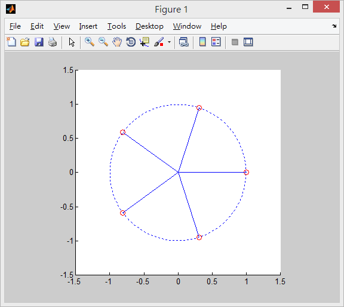
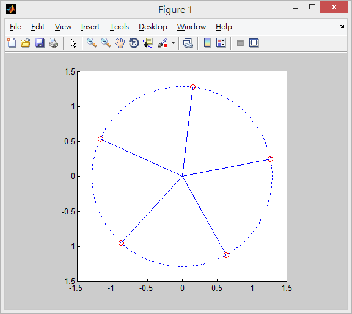

#說明

作業一

#程式碼

```
hold on
axis('equal',[-1.5,1.5,-1.5,1.5])

angle = linspace(0, 2*pi, 360);
r = 1
x = r*cos(angle);
y = r*sin(angle);
plot(x,y,':')

for i = 0:4
    x0 = r*cos(0/5+(i*2*pi)/5)
    y0 = r*sin(0/5+(i*2*pi)/5)
    plot(x0,y0,'Or',[0,x0],[0,y0])
end
```

#截圖



#說明

加分題

#程式碼
```
hold on
axis('equal',[-1.5,1.5,-1.5,1.5])

angle = linspace(0, 2*pi, 360);
r = 13^(1/10)
x = r*cos(angle);
y = r*sin(angle);
plot(x,y,':')

for i = 0:4
    x0 = r*cos(atan(3/2)/5+(i*2*pi)/5)
    y0 = r*sin(atan(3/2)/5+(i*2*pi)/5)
    plot(x0,y0,'Or',[0,x0],[0,y0])
end
```
#截圖


